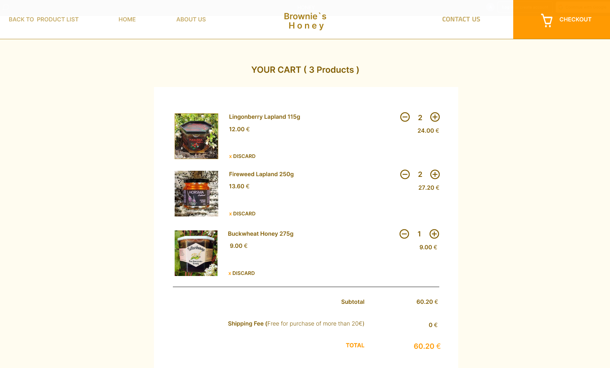

# Brownie-s-Honey-Ecommerce

Welcome to my first HTML/CSS project! This project is the culmination of my HTML and CSS programming class, aiming to apply and reinforce the fundamentals of web development. Inspired by the Arctic Honey Finland webpage, I have created a replica with real-time products and descriptions to practice both coding and UI design principles.

    

## Project Overview

The primary goals of this project were:
- **HTML/CSS Practice:** Strengthening my grasp of HTML and CSS through the implementation of a real-world webpage structure.
- **UI Design Exploration:** Using Figma, I dabbled in UI design to enhance the visual appeal and user experience of the webpage.
- **Real-Time Product Integration:** Incorporating actual product information to make the project more dynamic and practical.

## Features

- **Responsive Design:** The webpage is designed to be responsive, ensuring a seamless experience across various devices.
- **Product Showcase:** Real-time products and descriptions are integrated, providing a glimpse into the offerings of Arctic Honey Finland.
- **UI Design Elements:** Inspired by Figma exploration, I've incorporated UI design elements to enhance the aesthetics of the webpage.

  ## Products List
      

        
      

  
  ## Product Description
  

    
  

  

    
  

  
  ## Cart
  

    
  

  
  ## About Us Page
  

    
  

## How to Use

1. Clone the repository: `git clone https://github.com/t2hale00/Brownie-s-Honey-Ecommerce.git`
2. Open the `index.html` file in your preferred web browser.

Feel free to explore the code and offer any comments or suggestions. I'm keen on improving both my coding skills and UI design proficiency!

## Acknowledgments

- Arctic Honey Finland for inspiring this project.
- Figma for providing a platform to experiment with UI design.

---

If you happen to come across this project, I would greatly appreciate your comments and feedback. Feel free to reach out with any suggestions for improvement. Thank you for checking out my work!

